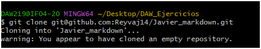
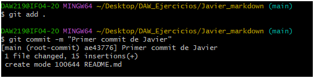
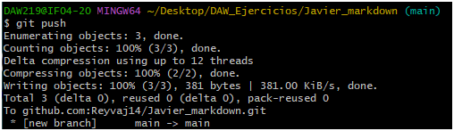

# Ejercicio 3
### Clonar el repositorio
`$ git clone git@github.com:Reyvaj14/Javier_markdown.git`

### Crear documento README.md
con el notepad++ creo el documento

### Añadir al Archivo README.md los comando utilizados y comitear
`$ git add .`
`$ git commit -m "Primer Commit Javier"`

### Subir los cambios al repositorio remoto
`$ git push`
 
 ###Crear un fichero privado.txt y una carpeta privado