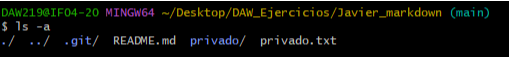
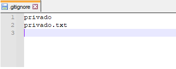
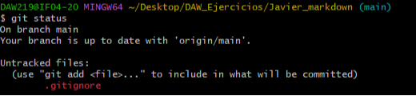
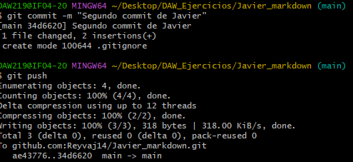
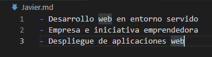
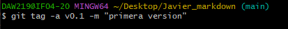
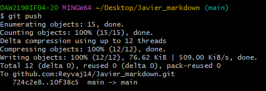

# Ejercicio 3
### Clonar el repositorio
`$ git clone git@github.com:Reyvaj14/Javier_markdown.git`
>

### Crear documento README.md
con el notepad++ creo el documento
>

### Añadir al Archivo README.md los comando utilizados y comitear
`$ git add .`
>
`$ git commit -m "Primer Commit Javier"`
>

### Subir los cambios al repositorio remoto
`$ git push`
>
 
### Crear un fichero privado.txt y una carpeta privado

###  Realizar los cambios oportunos para que tanto el archivo como la carpeta sean ignorados por git

>

>

>

### Documenta los puntos e) f) y g) en el fichero README.md
realizado como se muestra arriba
### Añade el fichero tunombre.md en el que se muestre un listado de los módulos en los que estás matriculado

### Crea un tag llamado v0.1

### Sube los cambios al repositorio remoto

### Por último, crea una tabla en el documento anterior en el que se muestre el nombre de 2 compañeros y su enlace al repositorio en GitLab o GitHub
| Nombre | Pagina |
| ----------- | ----------- |
| Tania | https://github.com/TaniaEF/TANIA_markdown |
| Adrian | https://github.com/AdriMedia/DAW215_Markdown |